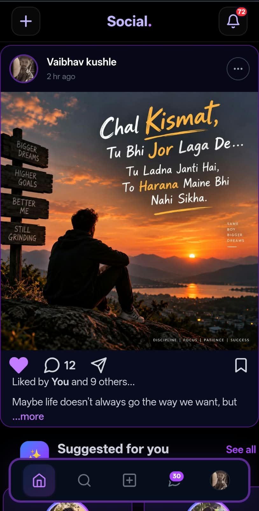
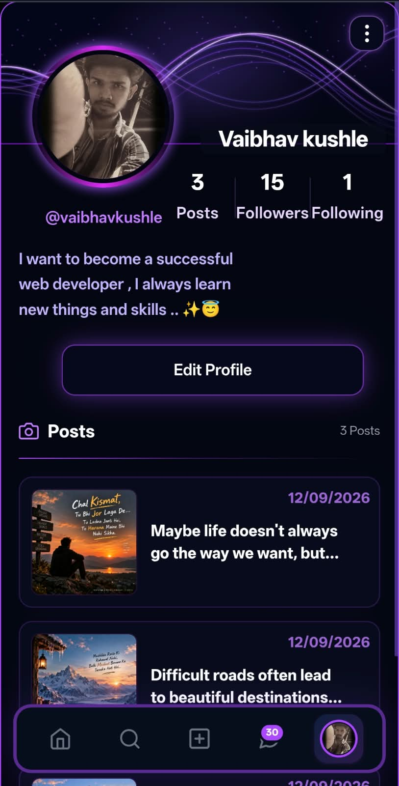
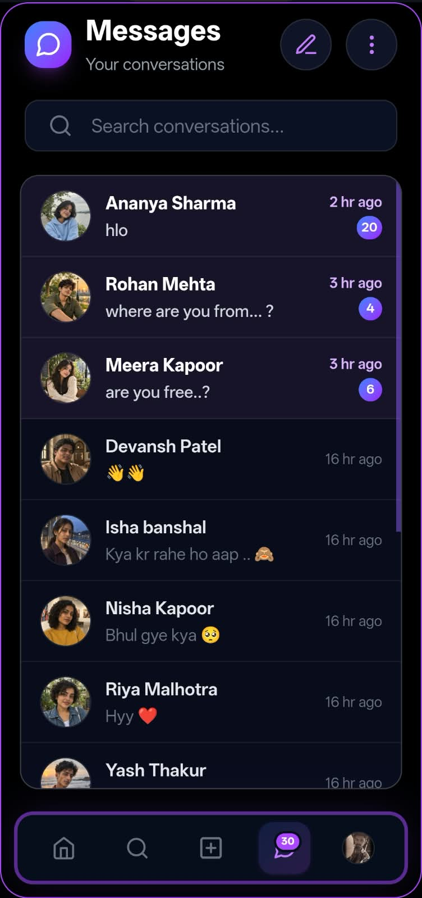
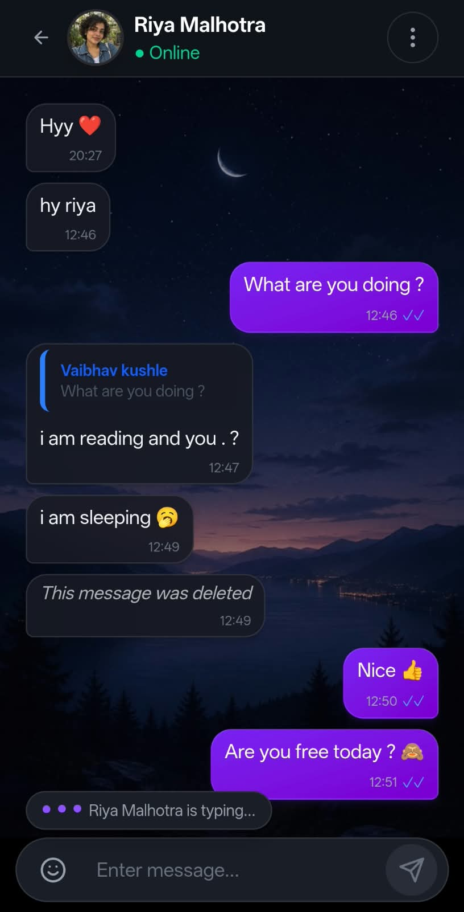
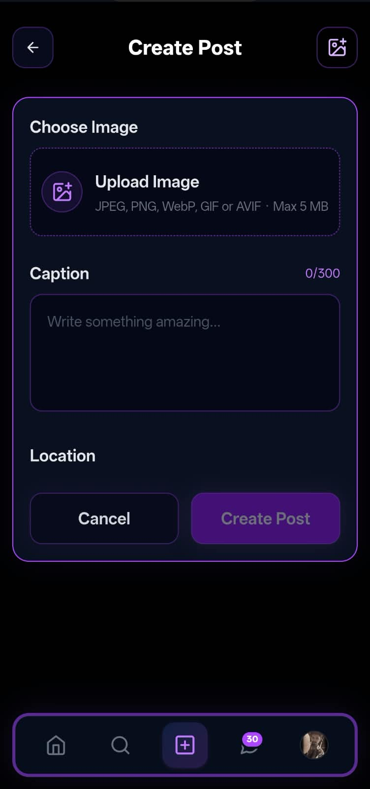
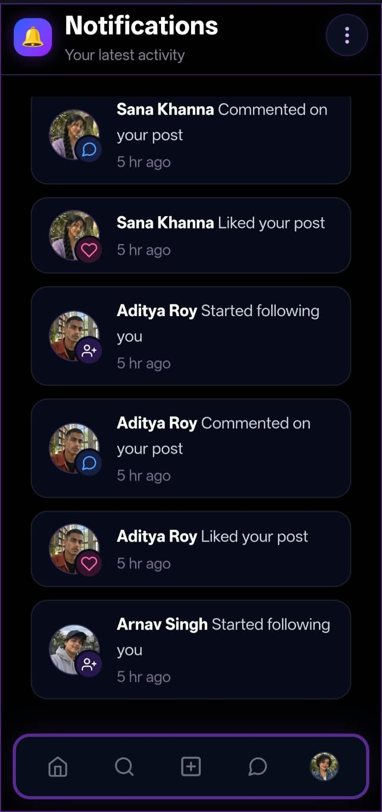
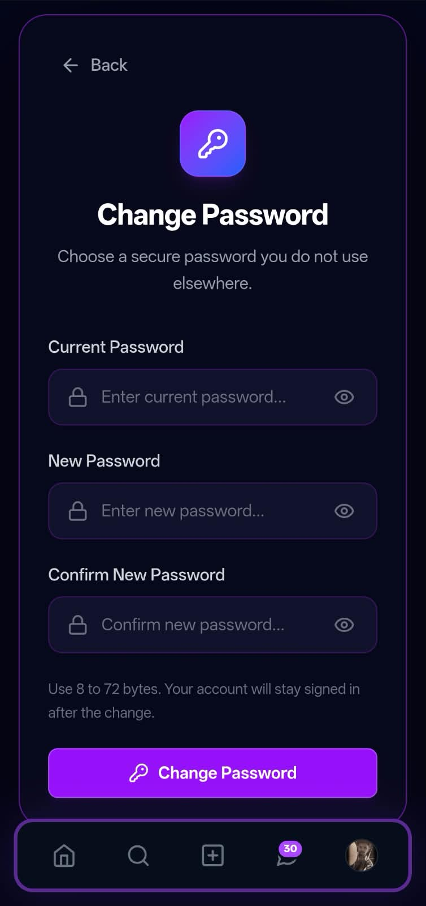

# MERN Social Media App

A full-stack MERN social media platform where users can create profiles, share image posts, follow other users, and interact through likes and comments. Built with React, Express, MongoDB, and Socket.IO, it also includes real-time notifications and private messaging with delivery/read receipts, typing indicators, and online presence.

The application uses JWT authentication with session revocation, MongoDB transactions for race-safe updates, and Cloudinary for secure image storage and validation.

## Features

### Authentication & Account

- User registration and login with JWT authentication
- Secure logout with server-side session/token revocation
- Change password with automatic re-authentication
- Automatic session invalidation across devices after password change
- Rate-limited login and registration with attempt-count feedback

### Profile

- View and edit own profile
- Profile picture upload
- View other users' profiles
- Followers/following lists with in-modal search
- Remove follower
- Paginated, infinite-scrolling profile posts

### Social & Search

- Follow / unfollow users
- Suggested users to follow with friend-of-friend recommendations and fallback
- Live user search by name

### Posts

- Create posts with image and caption
- Edit and delete own posts
- Cloudinary image storage
- Client- and server-side image validation
- Infinite-scrolling home feed
- Shareable post links
- Auto-scroll to a specific shared post
- Report posts
- Save / unsave posts
- Dedicated saved posts page

### Likes & Comments

- Like / unlike posts with animated interaction
- View users who liked a post
- Add, edit, and delete comments

### Notifications

- Real-time notifications for follows, likes, and comments using Socket.IO
- Live unread notification badge
- Infinite-scrolling notification history
- Mark notifications as read
- Multi-select notification deletion
- Automatic cleanup of stale post notifications

### Real-Time Messaging

- One-to-one real-time direct messaging using Socket.IO
- Conversation list with unread counts
- Conversations sorted by recent activity
- Message delivery and read receipts
- Typing indicators
- Online / offline presence
- Last-seen timestamps
- Optimistic message sending with failure/retry state
- Reply to messages, including swipe-to-reply
- Edit sent messages
- Delete messages for me / everyone
- Bulk message deletion
- Delete entire conversations
- Emoji picker
- Share posts directly in chat
- Inline shared-post previews

### Performance & Security

- Cursor-based pagination across feed, profile, messages, and notifications
- Server-side input validation
- Image MIME and file-signature validation
- Rate limiting for sensitive actions
- JWT session revocation
- MongoDB transactions for race-safe updates

## Tech Stack

### Frontend

- React 19
- Vite
- Tailwind CSS
- React Router DOM
- Axios
- Socket.IO Client

### Backend

- Node.js
- Express.js
- MongoDB
- Mongoose
- Socket.IO

### Authentication & Security

- JWT Authentication
- bcryptjs
- Express Rate Limit
- CORS
- Server-side input validation

### File & Image Handling

- Multer
- Cloudinary
- streamifier

## Screenshots

### Home Feed



### Profile



### Messages



### Chat



### Create Post



### Notifications



### Change Password



## Installation & Setup

### 1. Clone the Repository

```bash
git clone https://github.com/vaibhavkushle-coder/mern-social-app-v2.git
cd mern-social-app-v2
```

### 2. Install Dependencies

#### Backend

```bash
cd backend
npm install
```

#### Frontend

```bash
cd ../frontend
npm install
```

### 3. Environment Variables

The backend requires environment variables for database connection, authentication, Cloudinary, CORS, and other server configuration.

Create the environment file inside the backend folder:

```text
backend/.env
```

Use `backend/.env.example` as a reference for the required variables.

> Never commit `.env` files or secret API keys to GitHub.

### 4. Run the Application

Start the backend:

```bash
cd backend
npm run dev
```

In another terminal, start the frontend:

```bash
cd frontend
npm run dev
```

The frontend and backend run as separate development servers.

## Live Demo

[View Live Demo](https://frontend-one-omega-14.vercel.app/)

## Author

### Vaibhav Kushle

Aspiring Full Stack MERN Developer focused on building practical, real-world web applications.

- GitHub: [vaibhavkushle-coder](https://github.com/vaibhavkushle-coder)
- Project: `mern-social-app-v2`
